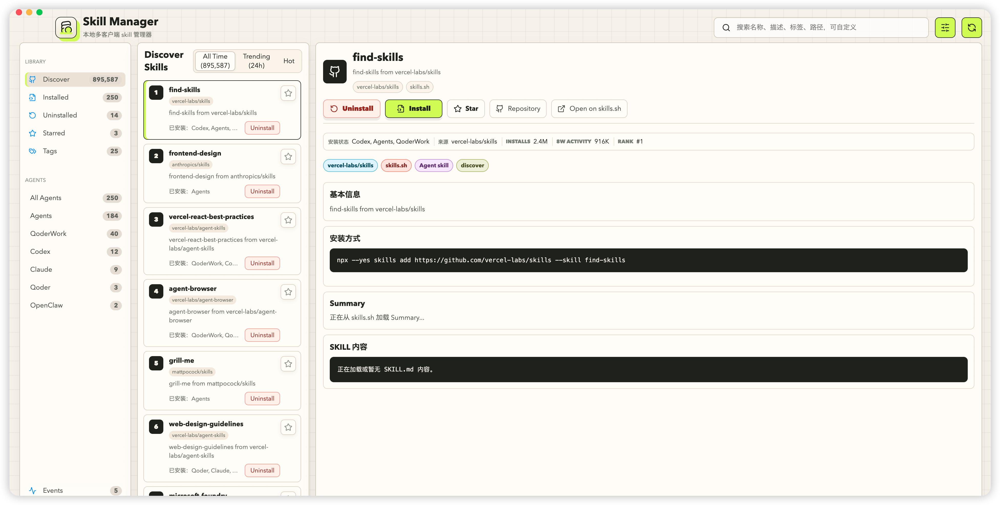
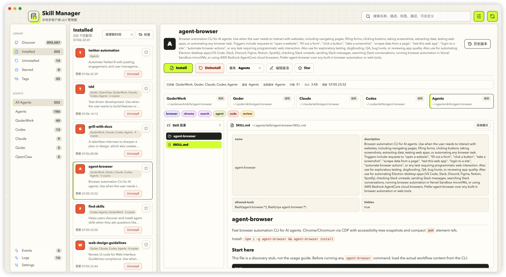
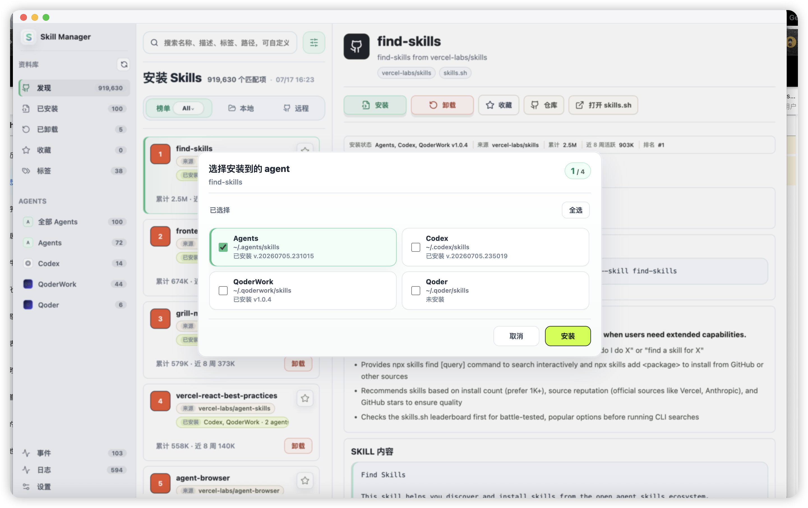

# Skill Manager

Skill Manager is a local desktop app for managing AI agent skills across multiple clients. It helps you browse installed `SKILL.md` packages, inspect their directory structure, edit skill files, discover popular skills from skills.sh, and install or uninstall skills across configured agents.

The app is built with Electron, React, and Vite.

## Screenshots

### Discover skills

Browse skills.sh rankings, search the leaderboard, inspect repository metadata, and install a skill into one or more configured agents.



### Local skill detail

Review installed or starred skills, inspect `SKILL.md`, browse the full directory tree, and see which agent copies exist locally.



### Multi-agent install

Install, uninstall, restore, and update can target multiple agent directories. The app can remember the previous selection or use a configured default.



## Features

- Discover skills from skills.sh with All Time, Trending, and Hot rankings.
- Search local and discover skills by configurable fields.
- Manage installed skills across multiple agent directories.
- Browse local tags in a tag cloud and jump to matching skills.
- Install, uninstall, restore, and update skills through background operation events.
- Move uninstalled skills into the app data directory instead of deleting them.
- View `SKILL.md` with a skill-friendly reader and full directory tree.
- Edit local skill files with history, diff, and rollback support.
- Star skills from Discover, Installed, or Uninstalled.
- Configure agents, ignore patterns, retention policy, and install defaults.
- Switch Settings between visual configuration and JSON configuration.

## Default Agent Sources

By default, Skill Manager scans:

- Codex: `~/.codex/skills`
- Agents: `~/.agents/skills`
- Claude: `~/.claude/skills`
- Qoder: `~/.qoder/skills`
- QoderWork: `~/.qoderwork/skills`
- OpenClaw: `~/.openclaw/skills`

These can be changed in Settings.

## App Data

Runtime data is stored in Electron's app data directory:

```text
~/Library/Application Support/skill-manager
```

Important subdirectories:

- `settings.json`: app settings, logs, events, agents, ignore rules.
- `history/`: edited file history and rollback versions.
- `managed-skills/uninstalled/`: skills moved by uninstall.
- `managed-skills/skills/`: app-managed copied skills.

## Requirements

For development:

- Node.js
- npm
- Git

For Discover install actions on user machines:

- Node.js / `npx`
- Git
- Network access to skills.sh and GitHub

## Install Dependencies

```bash
npm install
```

If your local `package-lock.json` points to an internal registry, regenerate it with your desired npm registry before sharing development setup:

```bash
rm package-lock.json
npm install --registry=https://registry.npmjs.org/
```

## Run In Development

```bash
npm run start
```

This starts Vite and Electron together.

## Build Frontend

```bash
npm run build
```

The web assets are generated into `dist/`.

## Package For macOS

The current package script builds a macOS DMG:

```bash
npm run dist:mac
```

Output:

```text
release/Skill Manager-<version>-arm64.dmg
```

The app icon is configured from:

```text
build/icon.icns
```

The generated DMG is currently unsigned. On another Mac, the first launch may require right-clicking the app and choosing **Open**, or allowing it in macOS Security settings.

To verify a DMG:

```bash
hdiutil verify "release/Skill Manager-<version>-arm64.dmg"
```

## Package For Windows

Windows NSIS packaging is configured in `package.json`. The app icon is:

```text
build/icon.ico
```

Build on a Windows machine:

```bash
npm install
npm run dist:win
```

The output will be written to `release/`.

You can also run the same command in a GitHub Actions Windows runner.

Recommended Windows validation:

- Agent directory detection and path handling.
- Install, uninstall, restore, and update flows.
- Opening files and revealing folders.
- `npx skills add` execution.
- Git availability.
- Settings, logs, and events persistence.

Unsigned Windows builds may trigger SmartScreen warnings. For public distribution, use a code signing certificate.

## GitHub Actions Builds

The repository includes a workflow at `.github/workflows/build.yml`.

Regular pushes to `master` or `main` build installer artifacts:

- macOS arm64 DMG
- macOS Intel/x64 DMG
- Windows x64 NSIS installer

Download them from the completed workflow run under **Actions -> Build Installers -> Artifacts**.

## Publish A Release

Formal releases are tag based. Update the version, push the commit, then push the tag:

```bash
npm version patch
git push
git push origin v<version>
```

Any tag matching `v*` triggers the release job. The workflow builds all installers, creates a GitHub Release, and uploads the `.dmg` and `.exe` files.

The package scripts use `--publish never` so `electron-builder` only creates local installers. GitHub Release publishing is handled by the release job with the built-in `GITHUB_TOKEN`.

## Project Structure

```text
electron/
  main.cjs       Electron main process, filesystem operations, install/uninstall, events.
  preload.cjs    Safe IPC bridge exposed to React.
  scanner.cjs    Local skill scanner, default sources, ignore rules.

src/
  App.jsx        Main React app.
  styles.css     UI styles.

build/
  icon.svg       Source app icon.
  icon.png       Runtime icon.
  icon.icns      macOS app icon.
  icon.ico       Windows app icon.

dist/            Built frontend assets.
release/         Packaged installers.
```

## Notes

- Installed skills are not deleted by uninstall. They are moved into the app-managed uninstalled directory.
- Settings support both visual editing and JSON editing.
- Operation Logs and Operation Events have configurable retention. By default they are kept forever.
- Tags are computed from local skill metadata and can be used to browse related installed skills.
- The app currently focuses on macOS, but the Electron codebase is portable with Windows packaging and path testing.
